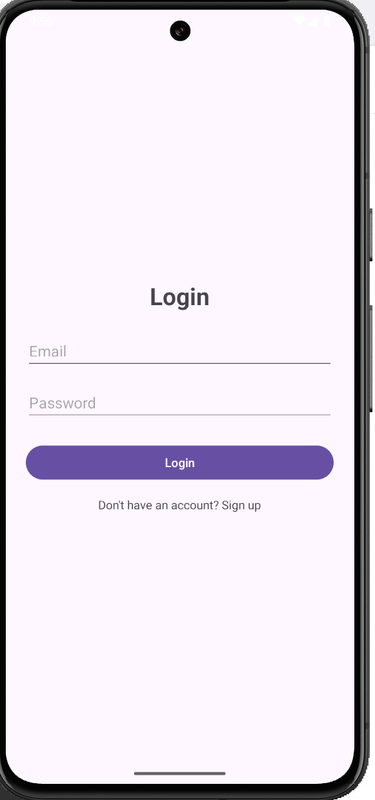
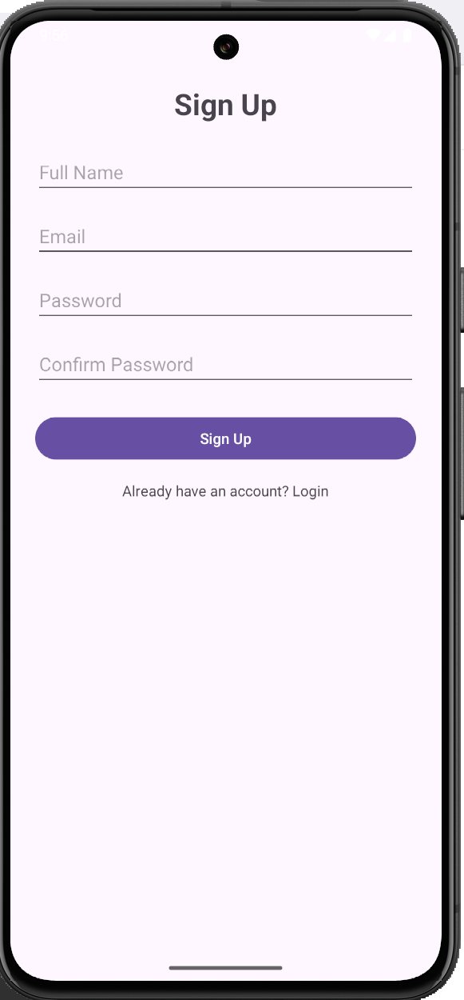
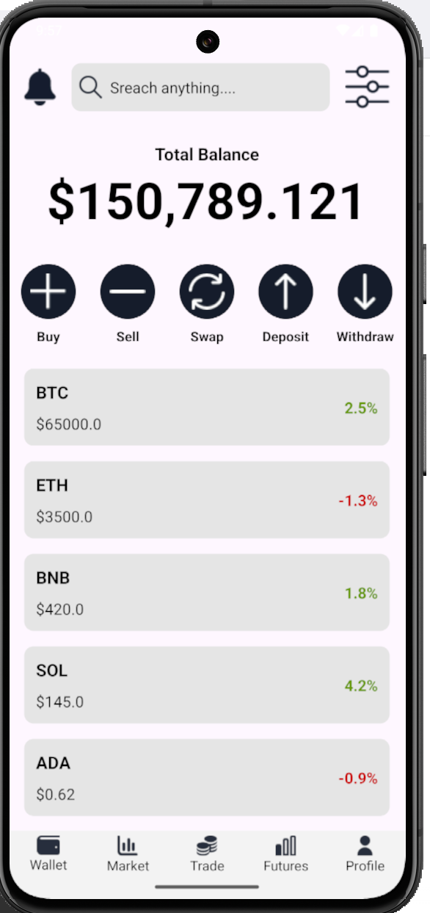

# Crypto App

Là ứng dụng Android mô phỏng ví tiền điện tử, cho phép người dùng:
- Đăng nhập / đăng ký tài khoản
- Theo dõi danh sách các đồng tiền điện tử (BTC, ETH,…)
- Xem biến động giá theo thời gian thực (mock data)
- Giao diện hiện đại, dễ sử dụng

## Công nghệ sử dụng

- Ngôn ngữ: Kotlin
- Kiến trúc: MVVM (Model – View – ViewModel)
- ViewBinding: Truy cập View an toàn, không dùng findViewById
- RecyclerView Adapter: Hiển thị danh sách Crypto

## 🖼 Screenshots

<table style="width:100%">
  <tr>
    <th>Login</th>
    <th>Sign Up</th>
    <th>Home</th>
  </tr>
  <tr>
    <td></td>
    <td></td>
    <td></td>
  </tr>
</table>
